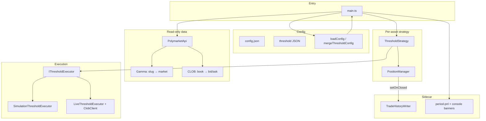
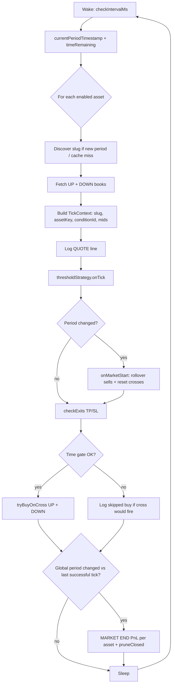

# Polymarket 15m UP/DOWN trading bot (TypeScript)

TypeScript bot for Polymarket **15-minute crypto Up/Down** markets. It polls CLOB books, runs a **threshold strategy** per asset (buy on upward price cross, multiple concurrent positions, per-position take-profit / stop-loss), logs live quotes, prints **period-end PnL**, and persists **trade history** to JSONL for reporting.

**Prices** are Polymarket-style decimals in **\[0, 1\]** (e.g. `0.45` ≈ 45¢ per share). Live orders use **GTC limits**; fills are not guaranteed instant.

---

## Features

| Area | Behavior |
|------|-----------|
| **Assets** | BTC, ETH, SOL, XRP — each enabled asset gets its own `ThresholdStrategy` + `PositionManager`; one shared CLOB client for orders. |
| **Buy** | When UP or DOWN **mid** crosses **up** through `buyPrice` (default `0.45`). Multiple opens allowed; each position tracked separately. |
| **Sell** | Per position: **take profit** at `takeProfitPrice` (default `0.65`), **stop loss** at `stopLossPrice` (default `0.15`). |
| **Time gate** | No **new standard** buys when `time_remaining_seconds ≤ minRemainingSeconds` (default **300** = 5 min). Existing positions still managed. |
| **Late phase (last 5 min)** | While `time_remaining ≤ latePhaseWindowSeconds` (default **300**): **buy** on upward cross of `latePhaseBuyPrice` (default **0.85**) if that side has **no** open position; **take profit** when mid ≥ `latePhaseSellPrice` (default **0.95**); **stop loss** when mid ≤ `latePhaseStopLossPrice` (default **0.55**). Same **one position per side** rule. Disable with `latePhaseEnabled: false`. |
| **Period rollover** | On new 15m period, open positions are rolled off (sell attempt + tracker close); **MARKET END PnL** banner per asset. |
| **Logging** | **QUOTE [ASSET]** each poll: bid / ask / mid for UP and DOWN. |
| **History** | Each close → append `trade_close` line to `history/YYYY-MM-DD.jsonl` (UTC). Bot start → `session` line. |
| **Report** | `npm run report` aggregates `history/*.jsonl` into a strategy summary + daily PnL (UTC). |

---

## Requirements

- **Node.js** ≥ 18  
- **npm** (or compatible) for install / scripts  

---

## Quick start

```bash
npm install
cp config.json.example config.json
# Edit config.json — see Configuration below
```

### Run (tsx)

| Script | Command |
|--------|---------|
| Simulation (no real orders) | `npm run simulation` |
| Live CLOB | `npm run dev` |
| Build | `npm run build` |
| Live (compiled) | `npm run start:live` |
| Strategy report from history | `npm run report` |

### CLI (`src/main.ts`)

```text
npx tsx src/main.ts [--simulation | --no-simulation | --live]
  [-c path/to/config.json]
  [--threshold-config path/to/threshold.json]
```

- **Live** requires `polymarket.private_key` in `config.json`.  
- **Simulation** can run without a key for read-only market data + simulated fills.

---

## Configuration

### 1. `config.json` (required)

| Section | Purpose |
|---------|---------|
| **`polymarket`** | `gamma_api_url`, `clob_api_url`, optional `api_key` / `api_secret` / `api_passphrase`, `private_key` (live), optional `proxy_wallet_address`, `signature_type`. |
| **`trading`** | Per-asset toggles: `enable_btc_trading`, `enable_eth_trading`, `enable_solana_trading`, `enable_xrp_trading`. |

If `trading` is omitted, defaults are **BTC on**, others **off**. If **all four** are `false`, the bot still runs **BTC only**.

**Gamma slugs** (current period `T` = Unix start of 15m window):

| Toggle | Slug pattern |
|--------|----------------|
| BTC | `btc-updown-15m-{T}` |
| ETH | `eth-updown-15m-{T}` |
| SOL | `sol-updown-15m-{T}` |
| XRP | `xrp-updown-15m-{T}` |

Copy from **`config.json.example`** and adjust.

### 2. Threshold strategy JSON (optional)

Override defaults via **`--threshold-config`** or merge a file like **`threshold-strategy.config.example.json`**:

| Field | Default | Meaning |
|-------|---------|---------|
| `buyPrice` | `0.45` | Buy trigger (upward cross of mid). |
| `takeProfitPrice` | `0.65` | Exit limit when mid ≥ this. |
| `stopLossPrice` | `0.30` | Exit limit when mid ≤ this. |
| `minRemainingSeconds` | `300` | Block new buys if remaining period time ≤ this. |
| `sharesPerOrder` | `5` | Size per buy. |
| `checkIntervalMs` | `1000` | Poll interval for the main loop. |
| `latePhaseEnabled` | `true` | Turn late-window 0.85→0.95 leg on/off. |
| `latePhaseWindowSeconds` | `300` | Apply late logic when remaining period time ≤ this (seconds). |
| `latePhaseBuyPrice` | `0.85` | GTC buy limit; entry on upward cross of this mid level. |
| `latePhaseSellPrice` | `0.95` | GTC sell when mid ≥ this (`late_take_profit`; `late_phase` only). |
| `latePhaseStopLossPrice` | `0.55` | GTC sell when mid ≤ this (`late_stop_loss`; `late_phase` only). |
| `latePhaseSharesPerOrder` | `null` | If `null`, uses `sharesPerOrder`. |

History rows include `entryKind`: `standard` vs `late_phase`. Close reasons include `late_take_profit` and `late_stop_loss`.

---

## Trade history & reports

### Files

- Directory: **`history/`** (in `.gitignore`).
- One file per UTC calendar day of **close**: `YYYY-MM-DD.jsonl`.
- Each line is a JSON object; main kinds: **`trade_close`**, **`session`**.

### Strategy report

```bash
npm run report
npx tsx src/strategy-test-report.ts --history-dir ./history --scale 100
```

| Flag | Description |
|------|-------------|
| `--history-dir` | Folder with `*.jsonl` (default `./history`). |
| `--scale` | Multiply cost/PnL in the printed summary (default **100**); stored rows stay raw. |
| `--markets-as-trades` | Set printed `markets` count = number of trades (style-only). |

**win_rate** and **directional_accuracy** in the report both use **% of trades with positive PnL** (true settlement direction is not stored).

---

## Project layout

```text
src/
  main.ts                 # Entry: multi-asset loop, quotes, PnL, history wiring
  config.ts               # loadConfig()
  api.ts                  # Gamma + CLOB HTTP (books, markets)
  clob.ts                 # Wallet, ClobClient, limit orders
  logger.ts
  period.ts               # 15m period timestamp helper
  trading-assets.ts       # Asset keys, slug prefixes, trading toggles defaults
  trading-history.ts      # TradeHistoryWriter → history/*.jsonl
  strategy-test-report.ts # npm run report
  types.ts                # Shared DTOs
  strategy/threshold/
    threshold-strategy.ts # Core logic
    position-manager.ts
    threshold-executor.ts # Simulation vs live orders
    config.ts             # ThresholdStrategyConfig defaults
    pricing.ts
    period-pnl.ts         # Period-end PnL banner helpers
    types.ts
    index.ts
config.json.example
threshold-strategy.config.example.json
```

---

## Build output

`npm run build` emits **ESM** to **`dist/`** (see `tsconfig.json`). Run compiled bot with `npm start` / `npm run start:live`.

---

## Developer guide

This section is for **contributors** and anyone who wants to change behavior safely. It mirrors the depth of a hand-maintained internal runbook.

### Mental model

1. **One global 15m clock** — `period.ts` aligns all assets to the same `periodTimestamp` (floor of Unix time / 900 × 900).
2. **One market instance per (asset, period)** — Gamma slug `{prefix}-{period}`; token IDs change when the period rolls.
3. **Strategy state is per asset** — Cross detection (`lastUpMid`, `lastDownMid`, `lastPeriod`) must not be shared across BTC vs ETH, hence **one `ThresholdStrategy` + `PositionManager` per runner** in `main.ts`.
4. **Execution is shared** — A single `SimulationThresholdExecutor` or `LiveThresholdExecutor` (one `ClobClient`) places all orders; positions still carry the correct `tokenId` per market.
5. **Two entry lanes** — `entryKind: standard` uses the 0.45/0.65/0.15 rules; `late_phase` uses 0.85 entry, 0.95 TP, 0.55 SL (standard rules do not apply to late positions).
6. **One position per side** — `getOpenForSide(UP|DOWN)` blocks another buy on that side until flat (standard and late share the same gate).
7. **History is append-only** — `TradeHistoryWriter` serializes writes on a promise chain so concurrent `close()` calls do not interleave lines.

### Architecture (high level)



### Main loop (runtime flow)



### `ThresholdStrategy.onTick` (order of operations)

Exact order matters when debugging “why did it buy/sell here?”:

| Step | What runs | Notes |
|------|-----------|--------|
| 1 | Compute `upMid` / `downMid` from `TokenPrice` | `midFromTokenPrice` needs both bid and ask. |
| 2 | **Period change** → `onMarketStart` | Closes **all open** positions for this manager (rollover), resets `lastPeriod`, standard + **late** cross baselines. |
| 3 | `checkExitsForOpenPositions` | **`late_phase`**: TP when mid ≥ `latePhaseSellPrice`; SL when mid ≤ `latePhaseStopLossPrice`. **`standard`**: TP/SL vs config. |
| 4 | If `timeRemainingSeconds > minRemainingSeconds` | Standard `tryBuyOnCross` (0.45 leg) for UP/DOWN; else log skipped standard buy if cross would have fired. |
| 5 | If `latePhaseEnabled` and `timeRemaining ≤ latePhaseWindowSeconds` | `tryLateBuyOnCross` (0.85 leg) using `lateLastUpMid` / `lateLastDownMid`. |
| 6 | Update `lastUpMid` / `lastDownMid` | End of tick — standard cross memory. |
| 7 | Update or clear `lateLastUpMid` / `lateLastDownMid` | Set mids when inside late window; **null** outside so the next entry seeds cleanly. |

### Module reference (for developers)

| Module | Responsibility | Depends on |
|--------|----------------|------------|
| `main.ts` | Orchestration: discovery, tick per asset, PnL banners, history hooks | config, api, clob, strategy, history |
| `config.ts` | Merge `config.json`; normalize empty strings → `null` for credentials | `trading-assets` defaults |
| `trading-assets.ts` | `TradingAssetKey`, slug prefixes, `enabledAssetKeys()` | — |
| `api.ts` | Gamma slug → market; CLOB REST books / market by condition | `axios`, `types` |
| `clob.ts` | `createClobClient`, `placeLimitOrder` (GTC, tick size) | `@polymarket/clob-client`, `ethers` |
| `period.ts` | `PERIOD_SEC`, `currentPeriodTimestamp()` | — |
| `trading-history.ts` | `TradeHistoryWriter`, JSONL rows | `Position` shape |
| `strategy-test-report.ts` | Read `*.jsonl`, aggregate stats | `trading-history` kinds |
| `threshold-strategy.ts` | Core rules: cross, TP/SL, time gate | `pricing`, `position-manager`, executor |
| `position-manager.ts` | Map of positions; `setOnClosed` hook | `types` |
| `threshold-executor.ts` | `IThresholdExecutor` impls | `clob.placeLimitOrder` |
| `pricing.ts` | Mid + `crossedAbove` | — |
| `period-pnl.ts` | `buildPeriodPnlSummary`, `formatPeriodPnlBanner` | closed `Position[]` |

### TypeScript & ESM conventions

- **`"type": "module"`** in `package.json`; **`module` / `moduleResolution`: `NodeNext`** in `tsconfig.json`.
- **Imports use `.js` extensions** in source (e.g. `./config.js`) — required for Node ESM resolution; `tsc` maps them to emitted `.js` files under `dist/`.
- **`strict: true`** — prefer explicit types on public APIs (`TickContext`, `ThresholdStrategyConfig`, history rows).
- **Run without build** — `tsx src/main.ts` is the fastest iteration loop; use `npx tsc --noEmit` before committing.

### Local developer workflow

```bash
# Install once
npm install

# Typecheck (no emit) — run often
npx tsc --noEmit

# Fast iteration: simulation + optional threshold overrides
npx tsx src/main.ts --simulation --threshold-config ./threshold-strategy.config.example.json

# Inspect history as it grows (PowerShell / bash)
Get-Content history/2026-03-21.jsonl   # Windows
tail -f history/$(date -u +%F).jsonl    # Unix (UTC date)

# Aggregate report (tweak scale / dir)
npm run report -- --history-dir ./history --scale 100
```

**Tips**

- Lower `checkIntervalMs` in threshold config only when you need snappier logs; it increases Gamma/CLOB load × number of enabled assets.
- Use **one asset** while developing strategy changes to reduce noise (`trading` toggles in `config.json`).

### Extending the codebase

| Goal | Where to change |
|------|------------------|
| Add a new crypto 15m market | `trading-assets.ts`: new `TradingAssetKey`, slug prefix, toggle in `TradingToggles` + `enabledAssetKeys` + `config.ts` merge + `config.json.example`. |
| Change entry/exit rules | `threshold-strategy.ts`, `pricing.ts`; expose new fields in `strategy/threshold/config.ts` + JSON example. |
| Different order type / sizing | `threshold-executor.ts` + `clob.ts` (`placeLimitOrder` params). |
| Extra audit fields | `trading-history.ts` row shape + `strategy-test-report.ts` if aggregated. |
| Custom logging sink | Replace or wrap `logger` (`src/logger.js`) or pass a custom `StrategyLogger` into `ThresholdStrategy` (would require a small `main.ts` refactor). |

### Debugging & troubleshooting

| Symptom | Things to check |
|---------|------------------|
| `No active market for prefix …` | Slug typo vs Polymarket; period alignment; market not yet listed / already closed. |
| No mid in QUOTE (`—`) | Empty or missing book side; CLOB 404 for stale `token_id` after rollover. |
| Buys never fire | `crossedAbove` needs **previous** mid; first tick after `onMarketStart` seeds baseline — need an actual cross through `buyPrice`. |
| `private_key required` in live | `config.json` → `polymarket.private_key`; API key triple optional (derived in `clob.ts`). |
| History file missing | `history/` created on first write; ensure process cwd is project root; check disk permissions. |
| Report shows 0 trades | Wrong `--history-dir`; files must be `*.jsonl`; lines must be `kind: "trade_close"`. |

### Verification checklist

Before opening a PR or running live money:

- [ ] `npx tsc --noEmit` passes  
- [ ] `npm run simulation` runs without unhandled errors for several minutes  
- [ ] `npm run report` reflects expected rows after simulated closes  
- [ ] Live: confirm wallet / allowance / Polymarket account outside this repo’s scope  

---

## Disclaimer

This software is for **educational / research** use. Trading involves risk. You are responsible for keys, compliance, and any losses. Not financial advice.
